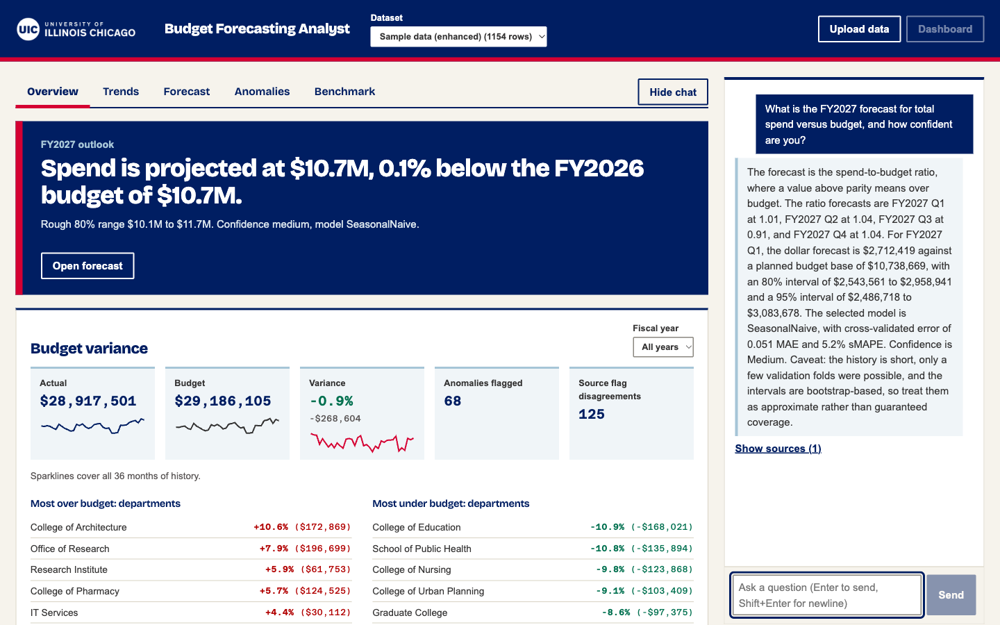
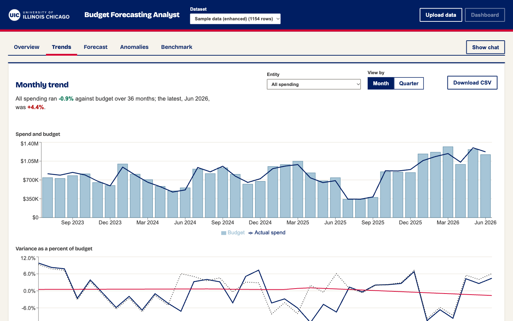
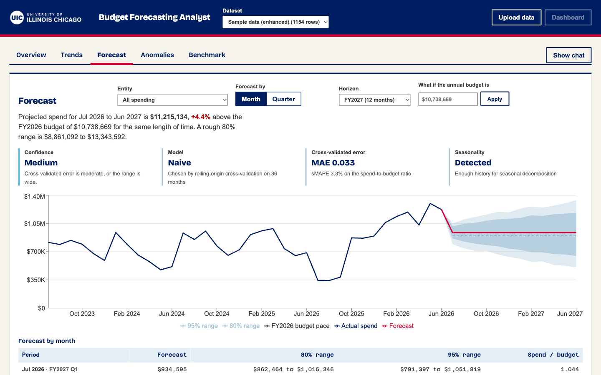
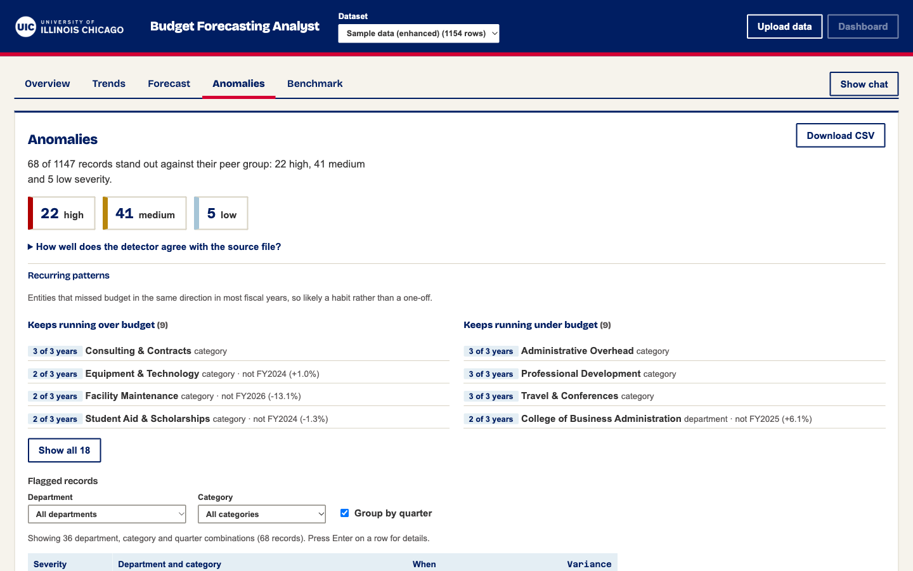
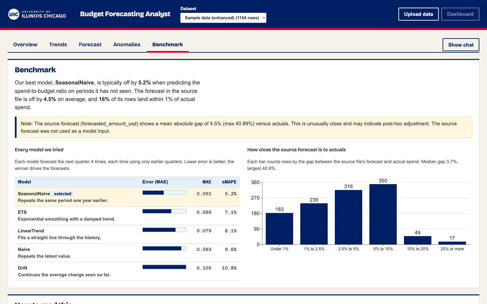
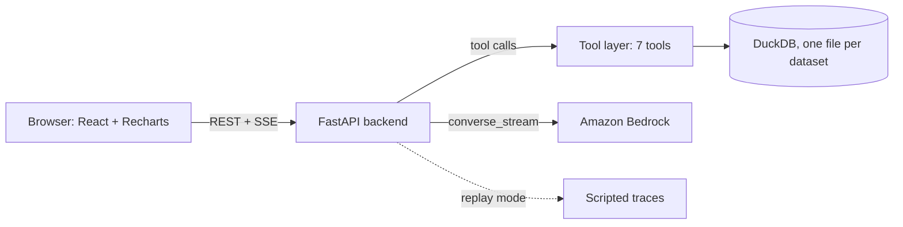

# Budget Forecasting Analyst

Demo app for a university budget office. A dashboard shows spend against budget, a forecast with prediction ranges, and
flagged anomalies, and a chat analyst answers variance, anomaly, forecast and reporting-health questions over the same
data. Every number comes from a tool that queries DuckDB; the model writes prose only, and a post-generation check flags
any figure it cannot trace to a tool result.



## Contents

1. [Quick start with Docker](#1-quick-start-with-docker)
2. [Local setup without Docker](#2-local-setup-without-docker)
3. [Configuration](#3-configuration)
4. [The dashboard](#4-the-dashboard)
5. [Architecture](#5-architecture)
6. [How grounding works](#6-how-grounding-works)
7. [Data caveats](#7-data-caveats)
8. [Deploying to AWS](#8-deploying-to-aws)

## 1. Quick start with Docker

Prerequisite: Docker with Compose v2.

```bash
cp .env.example .env
docker compose up --build
```

Open <http://localhost:3000>, click **Load sample data**, then explore the tabs or ask a question in the chat. The
dashboard is served on port 3000 and the API on port 8000. Datasets persist in the `duckdb_data` volume between runs.

Chat has two modes:

- **Replay mode** needs no credentials. Set `REPLAY_MODE=true` in `.env`, or open <http://localhost:3000/?replay=1>, and the
  seven scripted demo prompts stream pre-recorded, already grounded answers without importing boto3.
- **Live mode** calls Amazon Bedrock. Put credentials in `.env` for local use only (never commit it) or export them in
  your shell, and set `BEDROCK_MODEL_ID` to a model you have access to.

The dashboard tabs work in either mode and never call Bedrock.

## 2. Local setup without Docker

Prerequisites:

- **Python 3.14**, which is what the Docker image and `.python-version` use. Other versions are untested against the
  pinned dependencies.
- **Node.js 20 or later** and npm.

Run the backend from the repository root in one terminal:

```bash
python3.14 -m venv .venv
source .venv/bin/activate
pip install -r requirements-dev.txt        # backend dependencies plus pytest; use backend/requirements.txt for runtime only

cp .env.example .env                        # optional: only needed for live Bedrock chat
export DUCKDB_DATA_DIR="$PWD/.data"         # required: the default, /data/dbs, is not writable on most machines
export REPLAY_MODE=true                     # optional: scripted chat answers, no AWS credentials

cd backend
uvicorn main:app --reload --port 8000
```

`uvicorn` does not read `.env` by itself. Export the variables you need in the shell, as above, or run
`set -a; source ../.env; set +a` first. The API docs are at <http://localhost:8000/docs>.

Run the frontend in a second terminal:

```bash
cd frontend
npm ci
npm run dev
```

Open <http://localhost:3000> and click **Load sample data**. The dev server proxies nothing; it calls the API at
`http://localhost:8000`, which is the default. To point it elsewhere, set `VITE_API_BASE_URL` before `npm run dev`, and
add the frontend's origin to `CORS_ORIGINS` (comma separated) on the backend. The backend already allows
`http://localhost:3000` and `http://127.0.0.1:3000`.

Run the tests:

```bash
pytest                         # from the repository root, with the virtualenv active: 193 tests
cd frontend && npm test        # 7 tests
cd frontend && npm run build   # type-checks, then builds
```

Datasets are stored as DuckDB files under `DUCKDB_DATA_DIR`. Delete that directory to start over.

## 3. Configuration

Set these in `.env` (Docker) or in your shell (local). `.env.example` lists the defaults.

| Variable | Purpose |
|---|---|
| `REPLAY_MODE` | `true` serves scripted chat answers and never touches Bedrock. |
| `BEDROCK_MODEL_ID`, `AWS_*` | Live chat. Use an inference profile your account can call, with tool use enabled. |
| `DUCKDB_DATA_DIR` | Where datasets are stored. Docker sets it; set it yourself when running locally. |
| `CORS_ORIGINS` | Extra browser origins the API should accept. |
| `ANOMALY_SENSITIVITY`, `ANOMALY_ABS_FLOOR` | Robust z-score threshold (default 2.5) and absolute variance floor (default 30%). |
| `FORECAST_MAE_*`, `FORECAST_SMAPE_*`, `FORECAST_PI_WIDTH_MEDIUM` | Cut-offs that turn cross-validated error into a High, Medium or Low confidence label. |
| `KPI_TOP_N` | Rows in the "most over/under budget" lists. |

## 4. The dashboard

Styling follows [brand.uic.edu](https://brand.uic.edu): Navy Pier Blue, Fire Engine Red and Expo White, with the
brand's published fallback typefaces (Bricolage Grotesque, Arial and Azeret Mono). The licensed faces can replace them in
`frontend/src/styles.css`.

**Overview.** A banner states the FY2027 outlook, followed by KPI tiles with sparklines, the entities furthest over and
under budget, spend by fiscal year and fund source, and a table comparing every department, category and fund source's
FY2027 forecast with its FY2026 budget (the FY2027 budget is not in the data).

**Trends.** Spend against budget in dollars, and variance as a percent of budget with an STL trend and seasonal
component when there is enough history. Switch between monthly and quarterly. Monthly needs a dataset with a `month`
column; otherwise the app stays on quarters.



**Forecast.** Projected spend with 80% and 95% ranges, the model chosen by rolling-origin cross-validation, its error,
a High/Medium/Low confidence label, and a what-if field for the annual budget. Forecast by month or by quarter, over
FY2027 or two years. Entities with too little monthly history show a refusal with a one-click switch to quarterly.
Everything downloads as CSV.



**Anomalies.** Filter by severity, department and category. Records are grouped by department, category and quarter
(toggle it off for individual records); open a row for z-scores, peer group and the source file's verdict. Entities that
repeatedly miss budget in the same direction are listed separately, and a collapsed note explains how well the
detector agrees with the source file's own flags.



**Benchmark.** Cross-validated error for every model we tried, how close the source file's own forecast sits to actual
spend, and a short guide to the terms used.



### Forecasting notes

- Forecasts target the spend-vs-budget ratio (naive, seasonal naive, drift, damped ETS, linear trend), chosen per entity
  by rolling-origin cross-validation. Dollars are the ratio times the FY2026 budget divided by periods per year (4 or 12),
  so each point is one period.
- **Monthly grain** uses 36 months of history (July 2023 to June 2026), a seasonal period of 12 and a 24-month minimum
  training window. Gaps inside an entity's monthly history are filled by straight-line interpolation and the app says how
  many months were filled. With under 24 months, or no data in June 2026, the API refuses and points to the quarterly
  forecast. On the sample data, 40 of 43 entities forecast monthly.
- Department × Category forecasting is refused: those pairs average 2.2 rows of history.
- Monthly and quarterly forecasts are separate models and can disagree. Compare the confidence labels.

## 5. Architecture



- `backend/ingestion`: CSV/XLSX parsing, fuzzy column mapping, validation report, load into `budget_records`.
- `backend/analysis` and `backend/forecasting`: one shared variance query feeds both the dashboard and the chat tools, so
  they always agree. `analysis/dashboard.py` holds the benchmark and FY2027 outlook views.
- `backend/agent`: Bedrock agent loop (max 10 tool iterations, retry with backoff) and the grounding check.
- `frontend`: one React component per tab (`Overview` is `KpiPanel` and `Outlook`), plus the streaming chat.

REST endpoints used by the dashboard: `/datasets`, `/entities`, `/kpis`, `/variance` (`grain=month|quarter`), `/forecast`
(POST, `grain`, optional `planned_budget_total` for what-if), `/outlook`, `/anomalies`, `/benchmark`. Chat streams from
`/chat`. Design documents are in [docs/](docs/).

## 6. How grounding works

The model never computes figures. After it finishes a turn, the backend extracts every number from the answer
(dollar amounts, percentages, counts, ratios) and looks for a matching value in the results of the tools called in that
same turn. Matching uses small tolerances: abbreviated dollars (`$1.2M`) must agree with the source to the stated rounding,
percentages to the shown precision. Record ids, list markers and plain years are ignored.

If every number matches, the stream ends with a quiet `grounding_ok`. If any does not, the chat shows a banner above
the answer listing the unverified values. Treat those as unreliable. The Sources panel under each answer lists the tool
calls and the record ids behind it. Fabricated values are never written to logs.

## 7. Data caveats

The default sample is the enhanced file (1,154 rows, monthly grain, 21 departments, 14 categories, 7 funds). Seven rows are
excluded from totals and some rows are synthetic; both are reported at upload. The upload report surfaces these findings:

1. **Inconsistent variance record.** Rows where `variance_usd = 0` but `variance_pct` is not zero (BUD-00018 in the original file) are listed and carried as is. Results that include them show a warning.
2. **Source forecast looks post-hoc.** The source forecast column is compared with actuals. A small mean gap (under 5%) suggests it was adjusted after the fact, so it appears only in the Benchmark tab and is never a model input.
3. **Duplicate natural keys.** Repeated department + category + year + quarter combinations are counted; `record_id` stays the key and queries aggregate over the natural key. This is also why one event can appear as several monthly anomaly records.
4. **Anomaly label sign mismatch.** Source "Overrun" and "Underspend" labels often disagree with the sign of `variance_pct`, so they are not used for sign filtering. The detector (robust z-score within category peers OR |variance| of at least 30%) is compared with the source flags on the Anomalies tab.
5. **Variance cap.** `variance_pct` is capped at +/-50 in the original file; the detector works on the values as given and rows at a cap are counted. The enhanced file's synthetic rows exceed the cap.
6. **Row exclusions and short series.** Rows with `include_in_totals = FALSE` are left out of aggregates. Entities with fewer than 8 quarters get no seasonal decomposition, and forecasts for short series carry Low confidence or a refusal.

## 8. Deploying to AWS

CDK stack, deploy steps and teardown are in [infra/README.md](infra/README.md).

## Brand assets

The UIC name and logo are UIC marks. The header uses the white logo and this README the primary logo, both from
[brand.uic.edu](https://brand.uic.edu/visual-identity/logos/). Confirm approval with Strategic Marketing and
Communications (smcs@uic.edu) before using them outside UIC or in a public deployment.
