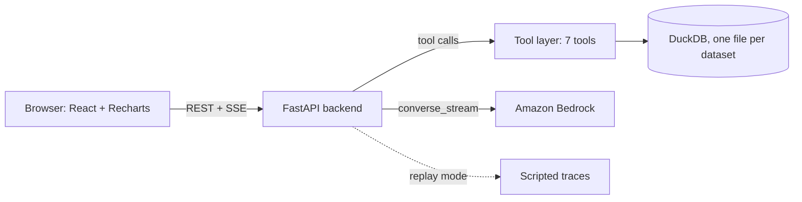

# Budget Forecasting Analyst

Demo app for a university budget office. A chat analyst answers variance, anomaly, forecast and reporting-health
questions over a budget dataset. Every number comes from a tool that queries DuckDB; the model writes prose only, and a
post-generation check flags any figure it cannot trace to a tool result.

## 1. Run instructions

Prerequisites: Docker with docker-compose (Node.js 20+ only if you run the frontend outside Docker).

```bash
cp .env.example .env
docker-compose up --build
```

Open <http://localhost:3000>, click **Load sample data**, then ask a question in the chat.

Live mode calls Amazon Bedrock. Put credentials in `.env` for local use only (never commit it) or export them in your
shell, and set `BEDROCK_MODEL_ID` to a model you have access to. Replay mode needs no credentials: set `REPLAY_MODE=true`
in `.env` (or open the app with `?replay=1`) and the seven scripted demo prompts stream pre-recorded, already grounded
answers without importing boto3.

Without Docker: `cd backend && pip install -r requirements.txt && uvicorn main:app --reload` and, in `frontend/`,
`npm ci && npm run dev`. Tests: `pip install -r requirements-dev.txt && pytest`, and `npm test` in `frontend/`.

## 2. Architecture



- `backend/ingestion`: CSV/XLSX parsing, fuzzy column mapping, validation report, load into `budget_records`.
- `backend/analysis` and `backend/forecasting`: one shared variance query feeds both the KPI panel and the chat tools, so the dashboard and chat always agree. Forecasts target the spend-vs-budget ratio (naive, seasonal naive, drift, damped ETS, linear trend, chosen by rolling-origin CV).
- `backend/agent`: Bedrock agent loop (max 10 tool iterations, retry with backoff) and the grounding check.
- `frontend`: dashboard panels (KPIs, trend, anomalies, benchmark) plus the streaming chat.

## 3. How grounding works

The model never computes figures. After it finishes a turn, the backend extracts every number from the answer
(dollar amounts, percentages, counts, ratios) and looks for a matching value in the results of the tools called in that
same turn. Matching uses small tolerances: abbreviated dollars (`$1.2M`) must agree with the source to the stated rounding,
percentages to the shown precision. Record ids, list markers and plain years are ignored.

If every number matches, the stream ends with a quiet `grounding_ok`. If any does not, the chat shows an amber banner above
the answer listing the unverified values. Treat those as unreliable. The Sources panel under each answer lists the tool
calls and the record ids behind it. Fabricated values are never written to logs.

## 4. Data caveats

The default sample is the enhanced file (1,154 rows, monthly grain, 21 departments, 14 categories, 7 funds). Seven rows are
excluded from totals and some rows are synthetic; both are reported at upload. The upload report surfaces these findings:

1. **Inconsistent variance record.** Rows where `variance_usd = 0` but `variance_pct` is not zero (BUD-00018 in the original file) are listed and carried as is. Results that include them show a warning.
2. **Source forecast looks post-hoc.** The source forecast column is compared with actuals. A small mean gap (under 5%) suggests it was adjusted after the fact, so it appears only in the Benchmark panel and is never a model input.
3. **Duplicate natural keys.** Repeated department + category + year + quarter combinations are counted; `record_id` stays the key and queries aggregate over the natural key.
4. **Anomaly label sign mismatch.** Source "Overrun" and "Underspend" labels often disagree with the sign of `variance_pct`, so they are not used for sign filtering. The detector (robust z-score within category peers OR |variance| of at least 30%) is compared against them in a confusion matrix.
5. **Variance cap.** `variance_pct` is capped at +/-50 in the original file; the detector works on the values as given and rows at a cap are counted. The enhanced file's synthetic rows exceed the cap.
6. **Row exclusions and short series.** Rows with `include_in_totals = FALSE` are left out of aggregates. Entities with fewer than 8 quarters get no seasonal decomposition, and forecasts for short series carry Low confidence or a refusal.

## Deploying to AWS

CDK stack, deploy steps and teardown are in [infra/README.md](infra/README.md).

## Dashboard

Tabs: Overview (FY2027 outlook, KPIs with sparklines, fund-source split, projected FY2027 vs FY2026 budget per entity), Trends, Forecast, Anomalies, Benchmark. Trends and Forecast switch between monthly and quarterly grain; monthly needs a dataset with a `month` column. The Forecast tab shows the 80% and 95% ranges, model and cross-validated error, a what-if annual budget, and CSV export. Styling follows brand.uic.edu (Navy Pier Blue, Fire Engine Red, Expo White) with the brand's fallback faces (Bricolage Grotesque, Arial, Azeret Mono).
